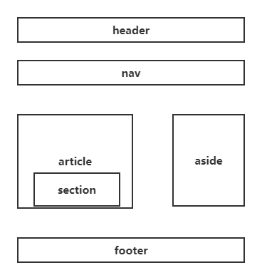

## HTML5

### 新增内容

- 语义化标签
- 视频和音频
- Canvas绘图
- Svg绘图
- 地理定位
- 推拽
- webSocket
- ......

### 语义化标签



- 优点是使得标签更有语义化，能更清楚地表达文档结构，提高代码的可读性
- 更易于SEO

### 引入CSS方式

#### 行内样式

> 所谓行内样式就是直接在标签中直接写样式

```css
<div style="background: red"></div>
```

#### 内部样式

> 所谓内部样式就是在<head>标签中写一个<style>标签

```html
<head>
	<!-- 省略 -->
    <style>
        <!-- 样式 -->
    </style>
</head>
```

#### 外部样式（重要）

> 所谓外部样式就是一般在<head>中用<link>引入外部的`css`文件

```html
<head>
    <link rel="stylesheet" href="style.css">
</head>
```

#### 导入方式

> 所谓导入方式就是在一个`css`文件中用`@import`导入另外一个`css`文件

```html
<style>
    @import url(‘路径’);
</style>
```

