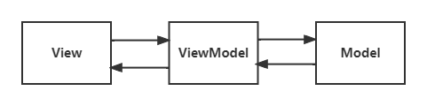
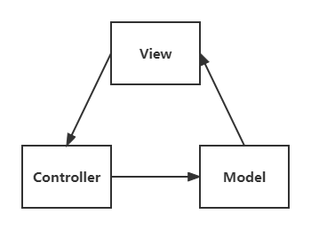

## Vue面试

### Vue工作原理

首先当一个Vue实例被创建的时候，Vue会遍历data中的属性，通过`Observer`类来转换成`getter/setter`的形式来追踪变化，当外界通过`Watcher`读取数据时，会触发`getter`从而`Dep`会将`Watcher`添加到依赖中，当数据发生了变化时候，会触发`setter`，从而向`Dep`中的依赖，也就是`Watcher`发送通知，`Watcher`接收到通知后，会向外界发送通知，变化通知到外界后可能会触发视图更新

### Vue双向数据绑定原理

#### 原理图

#### 初始化阶段

- 第一个是数据监听，`Vue`会遍历`data`中的属性，通过`Observer`类来转换成`getter/setter`的形式来追踪变化
- 第二是页面渲染，`Compile`解析模板指令，将模板中的指令替换成数据，然后初始化视图，并订阅`Watcher`来更新视图，此时`Watcher`会将自己添加到`Dep`中

#### 数据更新阶段

当数据发生变化的时候，会触发`Obersever`的`setter`，从而`Dep`会调用`notify`方法遍历通知所有的`Watcher`，`Watcher`收到通知后，也会对视图进行相应的更新

### v-model原理

实际上`v-model`是一个语法糖，他做了单向绑定数据`v-bind`和触发输入事件`input`

### 什么是MVVM？

#### 原理图

#### 含义

- M：Model，对应数据层的模型
- V：View，对应视图UI模型
- VM：ViewModel，一个抽象层，可以将Model和View连接了起来，实现了通信

#### 优点

- 低耦合：View和Model都可以独立于对方的变化和修改
- 可复用性：一个ViewModel里面的视图逻辑可以让很多个View使用
- 独立开发：开发人员专注于ViewModel开发，设计人员可以专注于UI开发
- 方便测试：可以方便对ViewModel进行测试

### 什么是MVC？

#### 原理图

#### 含义

- M：Model，是应用程序中用于处理应用程序数据逻辑的部分
- V：View，是应用程序中处理数据显示的部分
- C：Controller，是应用程序中处理用户交互的部分，从View读取数据，向Model发送数据

#### 优点

- 低耦合性
- 可复用性高
- 部署快
- 可维护性高
- 有利于软件工程化

### computed与watch区别

- computed是计算属性，而watch用于监听属性发生变化
- computed不支持异步，而watch支持异步
- computed有缓存而watch没有缓存
- computed必须要有返回值且默认第一次就进行计算，watch可以没有返回值并且默认第一次加载不会做监听，除非加上immediate设置为true

