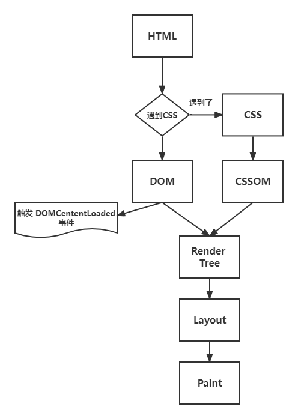
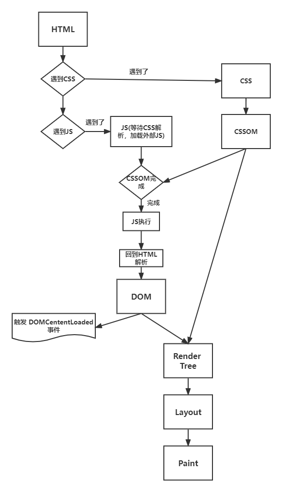

## 浏览器

### 浏览器解析HTML过程

#### DOMContentLoaded

> 当初始的 HTML 文档被完全加载和解析完成之后，DOMContentLoaded 事件被触发，而无需等待样式表、图像和子框架的完成加载

#### load

> 当整个页面及所有依赖资源如样式表和图片都已完成加载时，将触发load事件

#### case1：无JS，无CSS

#### case2：无JS，有CSS

> 在这个情况的时候，CSS不会阻碍DOM的解析，但是会阻碍DOM的渲染

#### case3：有JS，有CSS

- JS脚本会阻碍DOM解析
- CSS会阻碍JS脚本执行，因此也会间接阻碍DOM解析
- CSS必定会阻碍DOM渲染

### async defer 区别

- `async`是异步执行，此处的`DOMcontentLoaded`事件触发只关注`DOM`是否被解析完，与`async`无关。异步下载完毕后就马上执行，并不能保证多个`async`脚本按顺序执行，执行时机一定在`load`事件之前，可能在`DOMcontentLoaded`事件之前或者之后
- `defer`是延迟执行，执行时机是在`DOMcontentLoaded`事件之前，但它不会阻碍`DOM`解析，因为此处的`DOMcontentLoaded`事件触发是要`defer`脚本执行完毕后才会触发，多个`defer`脚本执行可以按顺序执行
- **区别就在于DOMContentLoaded事件的触发时间点**

### cookie sessionStorage localStorage 区别

> 共同点是都存储在客户端，且都是同源的

- 生命周期不同：`cookie`一般由服务器生成，可以设置失效时间，如果是在自己浏览器生成的话，默认是关系后会失效；`sessionStorage`关闭标签页或者浏览器就会失效；`localStorage`除非被清除，否则一直有效
- 大小不同：`cookie`大小一般不超过**4k**，`sessionStorage `和`localStorage`可以到**5M**
- 是否与服务端通信：`cookie`数据始终在同源的请求中携带，再浏览器和服务器之间来回传递；而`sessionStorage `和`localStorage`不会自动把数据发给浏览器，仅在本地保存

### cookie session 区别

- 存储位置不同：`cookie`存储在客户端，`session`存储在服务端，因此`session`也会更安全一些
- 存储大小不同：`cookie`大小一般不超过**4k**，而`session`要大得多，但是`session`太多太大的话会造成服务器的压力
- 有效期不同：`cookie`一般有效期较长，`session`有效期一般较短

### session token 区别

- 服务端是有记录状态：`session`记录了客户端和服务器的会话状态，而`token`是令牌，是一种访问资源的一种凭证，它可以使得服务器无状态化，不需要存储会话信息，它用计算来代替了储存
- `token`的安全性更好一些，因为每个`token`还有签名，可以防止监听，而`session`需要依靠链路层来保证安全性了